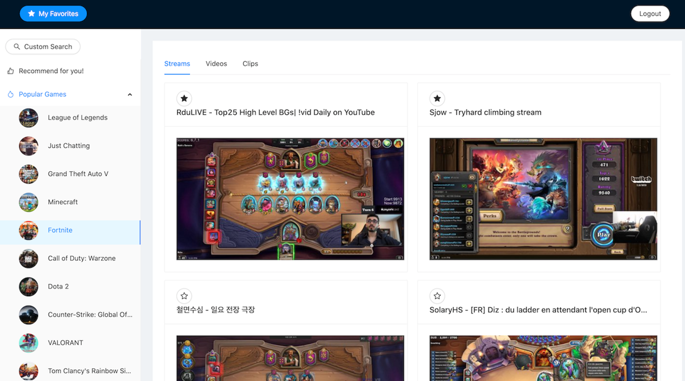

# Screenager

Project Date: May 2021

## Description

 

Screenager is a personalized Twitch resource recommendation engine that uses the Twitch API to retrieve real-time resources. With Screenager, users can search for and collect their favorite Twitch resources and receive personalized recommendations based on their like history or trending games.

This fullstack web application was built with React, Ant Design, JavaEE, Apache Tomcat, and MySQL, and features cookie-based authentication for user authorization. Screenager has been deployed on AWS EC2 for easy access.

To learn more, please see the [demo video](https://youtu.be/y7w9gKh-MhQ).

## Main Features

- User authentication: Users can log in and out of the application to access personalized content.

- Game search: Users can search for their favorite games and view top results grouped by streams, videos, or clips on Twitch.

- Favorite collection: Users can save their favorite game resources to their collection and access them later on.

- Personalized recommendations: Screenager provides personalized recommendations based on users' like history or trending games.

## Troubleshooting

[Token Expiration Workaround](./workaround.md)