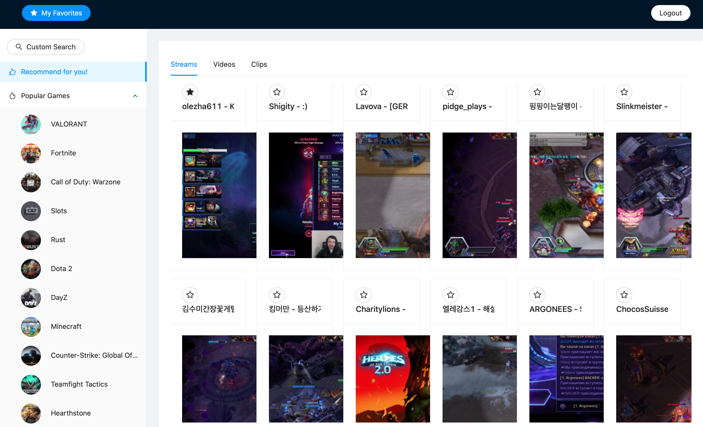

## Screenager

### Overview
Screenager is a personalized Twitch resources recommendation engine. Users can search and retrieve real-time Twitch resources using Twitch API and make their favorite collection. They can then get recommended based on trending games or their like history. To learn more use of Twitch API, please see the [Twitch API documentation](https://dev.twitch.tv/docs/api/).

### Tools and Technologies
* <strong>Front-end: </strong>React.js, Ant Design
* <strong>Back-end: </strong>Java, MySQL (AWS RDS)
* <strong>Search: </strong>Twitch API
* <strong>Recommendation: </strong>A content-based algorithm implemented in Java
* <strong>Deployment: </strong>AWS EC2

### Main Features
* Basic login/logout function
* Users can search any game they like and get some top results grouped by streams/videos/clips, and view them on Twitch
* Users can like/unlike a game resource and check it later on the favorite collection page
* Users will get recommended either by most popular games or by their own like history

### A Minor Issue
Please note that front end and back end are developed separately in local environment and uploaded to GitHub in the same fashion. However, I build the front end code and move them to the back-end project such that all code will be hosted on the same server for cost saving purpose, while it is more common practice to deploy front end and back end separately for large-scale projects.

 <em>Ruichen Zhang</em>
  May 9, 2021
