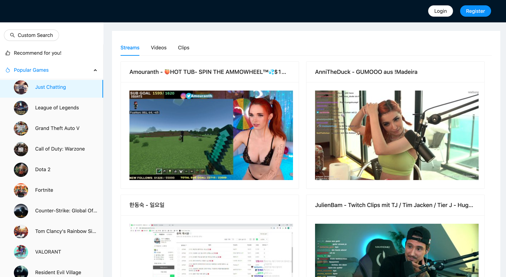
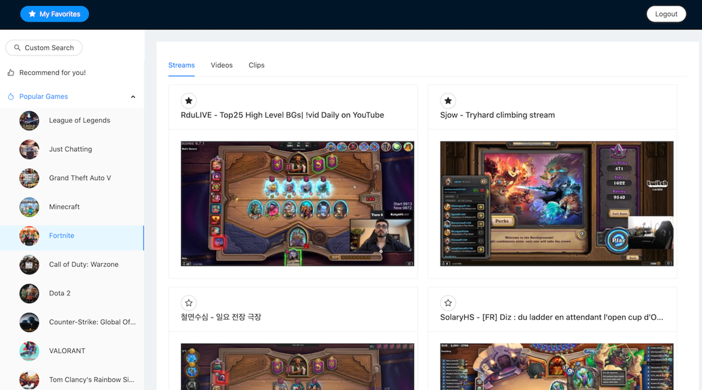

## Screenager

### Overview
Screenager is a personalized Twitch resources recommendation engine. Users can search and retrieve real-time Twitch resources using Twitch API and make their favorite collection. They can then get recommended based on trending games or their like history. To learn more details, please see the [demo video](https://www.youtube.com/watch?v=y7w9gKh-MhQ).

### Tools and Technologies
* <strong>Front-end: </strong>React.js, Ant Design
* <strong>Back-end: </strong>Java, MySQL (AWS RDS)
* <strong>Search: </strong>Twitch API
* <strong>Recommendation: </strong>A content-based algorithm implemented in Java
* <strong>Authentication: </strong>Cookie-based auth
* <strong>Deployment: </strong>AWS EC2

### Main Features

* Supports basic login/logout function
* Users can search any game they like and get some top results grouped by streams/videos/clips, and view them on the Twitch website
* Users can like/unlike a game resource and check it later on their favorite collection page
* Users will get recommended either by most popular games or by their own like history

### References
* Please go through [Create React App](https://facebook.github.io/create-react-app/docs/getting-started) on how to create, run and build a React.js project as well as back-end integration.
* To learn more use of Twitch API, please see the [Twitch API documentation](https://dev.twitch.tv/docs/api/).

 <em>Ruichen Zhang</em>
  May 9, 2021
